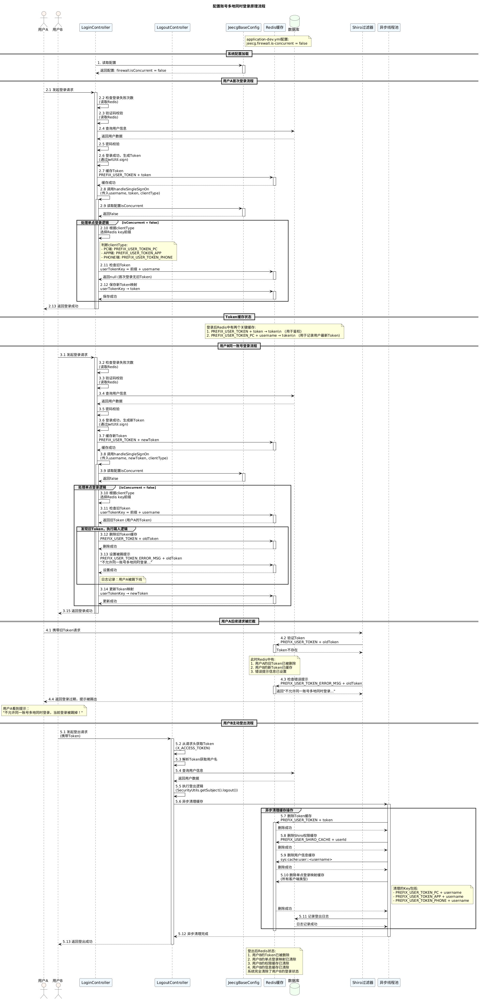

# 账号多地登录分析笔记

## 一、配置传入流程

> 根据需要在 `application-dev.yml` 等文件中配置：

```yaml
jeecg:
  firewall:
    # 是否允许同一账号多地同时登录 （为 true 时允许一起登录, 为 false 时新登录挤掉旧登录）
    is-concurrent: false
```

> 此配置项会被jeecg-boot\jeecg-boot-base-core\src\main\java\org\jeecg\config\JeecgBaseConfig.java加载到firewall属性中，代码片段如下：
```java
import org.jeecg.config.vo.*; // <--- 导入 Firewall 类
@Component("jeecgBaseConfig")
@Role(BeanDefinition.ROLE_INFRASTRUCTURE)
@ConfigurationProperties(prefix = "jeecg") // <--- 指定前缀 jeecg
public class JeecgBaseConfig {
    // ... 其他属性 ...
    private Firewall firewall; // <--- 嵌套对象 firewall
    public Firewall getFirewall() {
        return firewall;
    }
}
```
- @Component("jeecgBaseConfig") 注解将该类注册为 Spring 容器中的一个组件，名称为 jeecgBaseConfig。
- @Role(BeanDefinition.ROLE_INFRASTRUCTURE) 注解表示该组件是基础设施角色，一般用于框架内部组件。
- @ConfigurationProperties(prefix = "jeecg") 注解意味着它会自动读取配置文件中以 jeecg 开头的所有属性。

> 该类中的 firewall 属性是一个自定义的 Firewall 对象，它会映射配置文件中 jeecg.firewall 下的所有属性，供程序使用。

## 二、配置加载过程

> 在用户登录时，`LoginController.java` 中的 `handleSingleSignOn` 方法会根据 `firewall.isConcurrent` 的值来决定是否允许同一账号多地同时登录，代码片段如下：
```java
import org.jeecg.config.JeecgBaseConfig;
@RestController         // <--- 标记为 REST 控制器，用于处理 HTTP 请求
@RequestMapping("/sys") // <--- 定义请求的基础路径为 /sys
@Tag(name="用户登录")    // <--- OpenAPI 标签，标记该控制器的功能为“用户登录”
@Slf4j                  // <--- Lombok 注解，自动生成日志记录器 log
public class LoginController {
	@Autowired
	private JeecgBaseConfig jeecgBaseConfig; // <--- 注入 JeecgBaseConfig 组件
    /**
	 * @param username 用户名
	 * @param newToken 新生成的token
	 * @param clientType 客户端类型（PC、APP、PHONE）
	 */
	private void handleSingleSignOn(String username, String newToken, String clientType) {
		// 检查是否允许并发登录
		if (jeecgBaseConfig.getFirewall() == null || jeecgBaseConfig.getFirewall().getIsConcurrent()==null || Boolean.TRUE.equals(jeecgBaseConfig.getFirewall().getIsConcurrent())) {
			// 允许并发登录，只设置当前用户的token缓存，不踢掉之前的登录
			log.debug("并发登录已启用：用户[{}]在{}端允许多地同时登录", username, clientType);
			return; // 允许并发登录，直接返回
		}
		log.info("【并发登录限制已开启】 用户[{}]在{}端不允许多地同时登录", username, clientType);
        // 踢掉之前的登录等逻辑
    }
```
- 在这一段逻辑中，JeecgBaseConfig 组件被注入到 LoginController 中。
- handleSingleSignOn 方法会检查 firewall.isConcurrent 的值：
  - 如果为 true，表示允许同一账号多地同时登录，方法会直接返回，不做任何处理。
  - 如果为 false，表示不允许同一账号多地同时登录，方法会执行后续逻辑来踢掉之前的登录。

## 三、踢人流程

> 当 `firewall.isConcurrent` 配置为 `false` 时，`handleSingleSignOn` 方法会继续执行踢人逻辑。
```java
		// ... 前置判断逻辑已确认不允许并发登录 ...
		// 1. 根据客户端类型选择对应的Redis key前缀 (实现 PC、APP、PHONE 独立互不影响)
		String redisKeyPrefix;
		if (CommonConstant.CLIENT_TYPE_APP.equalsIgnoreCase(clientType)) {
			redisKeyPrefix = CommonConstant.PREFIX_USER_TOKEN_APP;      // APP端
		} else if (CommonConstant.CLIENT_TYPE_PHONE.equalsIgnoreCase(clientType)) {
			redisKeyPrefix = CommonConstant.PREFIX_USER_TOKEN_PHONE;    // 手机端
		} else {
			redisKeyPrefix = CommonConstant.PREFIX_USER_TOKEN_PC;       // 默认走PC端
		}
		
		// 记录用户当前Token的Key
		String userTokenKey = redisKeyPrefix + username;
		
		// 2. 获取该用户在当前客户端类型下之前的token (oldToken)
		Object oldTokenObj = redisUtil.get(userTokenKey);
		if (oldTokenObj != null && !oldTokenObj.equals(newToken)) { 
            // 旧token存在且与新token不同，说明有旧登录需要踢掉
            // 即使获取到了 oldToken，代码依然检查了它是否等于 newToken。
            // 这是为了防止极端情况下的“自杀”：如果因为网络延迟或重试，客户端在极短时间内发送了两次登录请求，或者 Redis 写入有微小延迟，这个判断确保了当前的有效 Token 不会被误认为是“旧 Token”而删除，保证了当前登录会话的稳定性。
            // 如果有两台设备几乎同时登录同一账号，只有第一个登录的设备会被保留，后续的登录请求会踢掉之前的登录。
			String oldToken = oldTokenObj.toString();
			// 3. 踢人动作：清除旧登录token的缓存
			redisUtil.del(CommonConstant.PREFIX_USER_TOKEN + oldToken);
			// 4. 设置被踢出提示信息 (有效期1小时)，供前端提示使用
			redisUtil.set(CommonConstant.PREFIX_USER_TOKEN_ERROR_MSG + oldToken, "不允许同一账号多地同时登录，当前登录被踢掉！", 60 * 1 * 60);
			log.info("【并发登录限制已开启】用户[{}]在{}端的旧登录已被踢下线！", username, clientType);
		}
		
		// 5. 保存新的token到单点登录缓存 (userTokenKey -> newToken)
		redisUtil.set(userTokenKey, newToken);
		redisUtil.expire(userTokenKey, JwtUtil.EXPIRE_TIME * 2 / 1000); // 设置过期时间为2倍JWT过期时间
```
- 首先，根据 `clientType` 确定 Redis Key 前缀，确保不同客户端（PC、APP、PHONE）之间的登录状态互不影响。
- 然后，使用 `username` 和前缀构建 Redis Key，获取该用户在当前客户端类型下的旧 Token。
- 如果旧 Token 存在且与新 Token 不同，说明用户在另一处已登录：
  - 删除旧 Token 的缓存，迫使持有旧 Token 的用户下次请求时被拦截。
  - 设置一个错误消息，提示用户其登录已被踢掉。
- 最后，更新 Redis 中该用户当前客户端类型下的 Token 为新生成的 Token，并设置适当的过期时间。

## 四、普通登录流程

> 从 LoginController 中login方法视角开始，一次完整的登录请求处理如下，重点在其中的Redis交互。
```java
@RequestMapping(value = "/login", method = RequestMethod.POST)
public Result<JSONObject> login(@RequestBody SysLoginModel sysLoginModel, HttpServletRequest request){
    String username = sysLoginModel.getUsername();
    // ... 此处省略解密密码等步骤 ...
    // 1. 【Redis读】检查是否被锁定
    if(isLoginFailOvertimes(username)){
        return result.error500("该用户登录失败次数过多，请于10分钟后再次登录！");
    }
    // 2. 【Redis读】验证码校验
    String realKey = validateCaptcha(sysLoginModel, result);
    if (realKey == null) {
        return result;
    }
    // 3. 数据库与密码逻辑校验
    // ... 查询数据库，校验密码 ...
    if (!syspassword.equals(userpassword)) {
        // 4. 【Redis写】密码错误，增加失败计数
        addLoginFailOvertimes(username);
        result.error500("用户名或密码错误");
        return result;
    }
    // 5. 【Redis写】登录成功，生成并缓存 Token
    userInfo(sysUser, result, request, CommonConstant.CLIENT_TYPE_PC);
    // 6. 【Redis删】清理临时缓存
    redisUtil.del(realKey); // 删除验证码，防止重用
    redisUtil.del(CommonConstant.LOGIN_FAIL + username); // 删除失败计数，重置尝试次数
    // 7. 记录日志 ...
    return result;
}
```

> `userInfo` 方法是登录验证通过后，构建用户上下文的步骤。

```java
	private Result<JSONObject> userInfo(SysUser sysUser, Result<JSONObject> result, HttpServletRequest request, String clientType) {
		// ... 省略变量准备 ...
		// 1. 生成 JWT Token
		String token = JwtUtil.sign(username, syspassword, clientType);
		// 2. 将 Token 存入 Redis (设置过期时间)
		redisUtil.set(CommonConstant.PREFIX_USER_TOKEN + token, token);
		redisUtil.expire(CommonConstant.PREFIX_USER_TOKEN + token, expireTime);
		// 3. 处理单点登录 (踢人逻辑)
		handleSingleSignOn(username, token, clientType);
		// 4. 设置登录租户 (多租户逻辑，略)
		Result<JSONObject> loginTenantError = sysUserService.setLoginTenant(sysUser, obj, username,result);
        // 5.设置登录用户信息，用于前端展示，还会写入数据库(`sysUserService.updateUserDepart`)
		obj.put("userInfo", sysUser);
		// 6. 初始化登录部门、Vue 版本判断与字典加载 (略)
		return result;
	}
```
## 五、Token 生命周期
*   **Token 缓存**: `PREFIX_USER_TOKEN + token` -> Token 字符串。
    *   这是 Shiro 用于鉴权的凭证，大部分操作都需要使用token进行鉴权。
    *   Token 是通过 `JwtUtil.sign` 签名的，包含用户名、密码和客户端类型，虽然 JWT 本身包含用户信息且自签名（无状态），但为了实现“登出”、“踢人”等即时失效功能，系统强制要求 Token 必须存在于 Redis 此 Key 中才算有效。
    *   在此缓存表中，没有用户信息，只有 Token 字符串本身，实质上是服务端维护的“有效 Token 白名单”。
    *   当用户注销或被踢时，系统通过删除此 Key 来立即使 JWT 失效，通过 Shiro 过滤器进行拦截。
*   **用户映射缓存** (用于踢人): `PREFIX_USER_TOKEN_PC + username` -> Token 字符串。
    *   记录该用户当前在 PC 端持有的最新 Token，体现用户与token的映射关系。
    *   在 `handleSingleSignOn` 中维护。

## 六、登出流程
> 用户主动登出时，`LogoutController.java` 中的 `logout` 方法会删除 Token 缓存，代码片段如下：
```java
/**
 * 退出登录
 * @param request
 * @param response
 * @return
 */
@RequestMapping(value = "/logout")
public Result<Object> logout(HttpServletRequest request,HttpServletResponse response) {
    //用户退出逻辑
    String token = request.getHeader(CommonConstant.X_ACCESS_TOKEN);
    if(oConvertUtils.isEmpty(token)) return Result.error("退出登录失败！");
    String username = JwtUtil.getUsername(token);
    LoginUser sysUser = sysBaseApi.getUserByName(username);
    if(sysUser!=null) {
        asyncClearLogoutCache(token, sysUser); // 异步清理
        SecurityUtils.getSubject().logout();
        return Result.ok("退出登录成功！");
    } else return Result.error("Token无效!");
}
/**
 * 清理用户缓存 
 * @param token
 * @param sysUser
 */
private void asyncClearLogoutCache(String token, LoginUser sysUser) {
    cachedThreadPool.execute(()->{
        //清空用户登录Token缓存
        redisUtil.del(CommonConstant.PREFIX_USER_TOKEN + token);
        //清空用户登录Shiro权限缓存
        redisUtil.del(CommonConstant.PREFIX_USER_SHIRO_CACHE + sysUser.getId());
        //清空用户的缓存信息（包括部门信息），例如sys:cache:user::<username>
        redisUtil.del(String.format("%s::%s", CacheConstant.SYS_USERS_CACHE, sysUser.getUsername()));
        //清空是否允许同一账号多地同时登录缓存（PC端和APP端）
        redisUtil.del(CommonConstant.PREFIX_USER_TOKEN_PC + sysUser.getUsername());
        redisUtil.del(CommonConstant.PREFIX_USER_TOKEN_APP + sysUser.getUsername());
        redisUtil.del(CommonConstant.PREFIX_USER_TOKEN_PHONE + sysUser.getUsername());
        baseCommonService.addLog("用户名: "+sysUser.getRealname()+",退出成功！", CommonConstant.LOG_TYPE_1, null, sysUser);
        log.debug("【退出成功操作】异步处理，退出后，清理用户缓存： "+sysUser.getRealname());
    });
}
```
- 在登出过程中，系统会删除与该用户相关的所有缓存，包括 Token 缓存、Shiro 权限缓存、用户信息缓存以及多地登录映射缓存，确保用户完全退出系统。


## 总体流程图（根据笔记使用AI生成，进行过少量修正）


> 流程图代码

```plantuml
@startuml
title 配置账号多地同时登录原理流程

' 定义颜色
skinparam ParticipantBackgroundColor #F0F8FF
skinparam ActorBackgroundColor #FFF5EE
skinparam DatabaseBackgroundColor #F0FFF0

' 定义参与者
actor "用户A" as UserA
actor "用户B" as UserB
participant "LoginController" as LC
participant "LogoutController" as LogoutC
participant "JeecgBaseConfig" as JBC
participant "Redis缓存" as Redis
database "数据库" as DB
participant "Shiro过滤器" as Filter
participant "异步线程池" as AsyncPool

' 定义全局配置部分
note right of JBC
  application-dev.yml配置:
  jeecg.firewall.is-concurrent = false
end note

' 流程开始
== 系统配置加载 ==

LC -> JBC : 1. 读取配置
activate JBC
JBC --> LC : 返回配置: firewall.isConcurrent = false
deactivate JBC

== 用户A首次登录流程 ==

UserA -> LC : 2.1 发起登录请求
activate LC

LC -> LC : 2.2 检查登录失败次数\n(读取Redis)
LC -> LC : 2.3 验证码校验\n(读取Redis)

LC -> DB : 2.4 查询用户信息
DB --> LC : 返回用户数据

LC -> LC : 2.5 密码校验
LC -> LC : 2.6 登录成功，生成Token\n(通过JwtUtil.sign)

LC -> Redis : 2.7 缓存Token\nPREFIX_USER_TOKEN + token
activate Redis
Redis --> LC : 缓存成功
deactivate Redis

' 调用处理单点登录
LC -> LC : 2.8 调用handleSingleSignOn\n(传入username, token, clientType)
activate LC

LC -> JBC : 2.9 读取配置isConcurrent
activate JBC
JBC --> LC : 返回false
deactivate JBC

group 处理单点登录逻辑 [isConcurrent = false]
    LC -> LC : 2.10 根据clientType\n选择Redis key前缀
    note right of LC
        判断clientType:
        - PC端: PREFIX_USER_TOKEN_PC
        - APP端: PREFIX_USER_TOKEN_APP
        - PHONE端: PREFIX_USER_TOKEN_PHONE
    end note
    
    LC -> Redis : 2.11 检查旧Token\nuserTokenKey = 前缀 + username
    activate Redis
    Redis --> LC : 返回null (首次登录无旧Token)
    deactivate Redis
    
    LC -> Redis : 2.12 保存新Token映射\nuserTokenKey → token
    activate Redis
    Redis --> LC : 保存成功
    deactivate Redis
end

LC --> UserA : 2.13 返回登录成功

deactivate LC
deactivate LC

== Token缓存状态 ==

note over Redis
  登录后Redis中有两个关键缓存:
  1. PREFIX_USER_TOKEN + token → token\n   (用于鉴权)
  2. PREFIX_USER_TOKEN_PC + username → token\n   (用于记录用户最新Token)
end note

== 用户B同一账号登录流程 ==

UserB -> LC : 3.1 发起登录请求
activate LC

LC -> LC : 3.2 检查登录失败次数\n(读取Redis)
LC -> LC : 3.3 验证码校验\n(读取Redis)

LC -> DB : 3.4 查询用户信息
DB --> LC : 返回用户数据

LC -> LC : 3.5 密码校验
LC -> LC : 3.6 登录成功，生成新Token\n(通过JwtUtil.sign)

LC -> Redis : 3.7 缓存新Token\nPREFIX_USER_TOKEN + newToken
activate Redis
Redis --> LC : 缓存成功
deactivate Redis

LC -> LC : 3.8 调用handleSingleSignOn\n(传入username, newToken, clientType)
activate LC

LC -> JBC : 3.9 读取配置isConcurrent
activate JBC
JBC --> LC : 返回false
deactivate JBC

group 处理单点登录逻辑 [isConcurrent = false]
    LC -> LC : 3.10 根据clientType\n选择Redis key前缀
    LC -> Redis : 3.11 检查旧Token\nuserTokenKey = 前缀 + username
    activate Redis
    Redis --> LC : 返回旧Token (用户A的Token)
    deactivate Redis
    
    group 发现旧Token，执行踢人逻辑
        LC -> Redis : 3.12 删除旧Token缓存\nPREFIX_USER_TOKEN + oldToken
        activate Redis
        Redis --> LC : 删除成功
        deactivate Redis
        
        LC -> Redis : 3.13 设置被踢提示\nPREFIX_USER_TOKEN_ERROR_MSG + oldToken\n"不允许同一账号多地同时登录..."
        activate Redis
        Redis --> LC : 设置成功
        deactivate Redis
        
        note right of LC : 日志记录：用户A被踢下线
    end
    
    LC -> Redis : 3.14 更新Token映射\nuserTokenKey → newToken
    activate Redis
    Redis --> LC : 更新成功
    deactivate Redis
end

LC --> UserB : 3.15 返回登录成功
deactivate LC
deactivate LC

== 用户A后续请求被拦截 ==

UserA -> Filter : 4.1 携带旧Token请求
Filter -> Redis : 4.2 验证Token\nPREFIX_USER_TOKEN + oldToken
activate Redis
Redis --> Filter : Token不存在
deactivate Redis

note over Redis
  此时Redis中有:
  1. 用户A的旧Token已被删除
  2. 用户B的新Token已缓存
  3. 错误提示信息已设置
end note

Filter -> Redis : 4.3 检查错误提示\nPREFIX_USER_TOKEN_ERROR_MSG + oldToken
activate Redis
Redis --> Filter : 返回"不允许同一账号多地同时登录..."
deactivate Redis

Filter --> UserA : 4.4 返回登录过期，提示被踢出
note over UserA : 用户A看到提示：\n"不允许同一账号多地同时登录，当前登录被踢掉！"

== 用户B主动登出流程 ==

UserB -> LogoutC : 5.1 发起登出请求\n(携带Token)
activate LogoutC

LogoutC -> LogoutC : 5.2 从请求头获取Token\n(X_ACCESS_TOKEN)
LogoutC -> LogoutC : 5.3 解析Token获取用户名
LogoutC -> DB : 5.4 查询用户信息
DB --> LogoutC : 返回用户数据

LogoutC -> LogoutC : 5.5 执行登出逻辑\n(SecurityUtils.getSubject().logout())

LogoutC -> AsyncPool : 5.6 异步清理缓存
activate AsyncPool

group 异步清理缓存操作
    AsyncPool -> Redis : 5.7 删除Token缓存\nPREFIX_USER_TOKEN + token
    activate Redis
    Redis --> AsyncPool : 删除成功
    
    AsyncPool -> Redis : 5.8 删除Shiro权限缓存\nPREFIX_USER_SHIRO_CACHE + userId
    Redis --> AsyncPool : 删除成功
    
    AsyncPool -> Redis : 5.9 删除用户信息缓存\nsys:cache:user::<username>
    Redis --> AsyncPool : 删除成功
    
    AsyncPool -> Redis : 5.10 删除单点登录映射缓存\n(所有客户端类型)
    note right of AsyncPool
        清理的Key包括:
        - PREFIX_USER_TOKEN_PC + username
        - PREFIX_USER_TOKEN_APP + username
        - PREFIX_USER_TOKEN_PHONE + username
    end note
    Redis --> AsyncPool : 删除成功
    
    AsyncPool -> DB : 5.11 记录登出日志
    DB --> AsyncPool : 日志记录成功
end

deactivate Redis
AsyncPool --> LogoutC : 5.12 异步清理完成
deactivate AsyncPool

LogoutC --> UserB : 5.13 返回登出成功
deactivate LogoutC

note over Redis
  登出后Redis状态:
  1. 用户B的Token已被删除
  2. 用户B的单点登录映射已清除
  3. 用户B的权限缓存已清除
  4. 用户B的信息缓存已清除
  系统完全清除了用户B的登录状态
end note

@enduml
```
