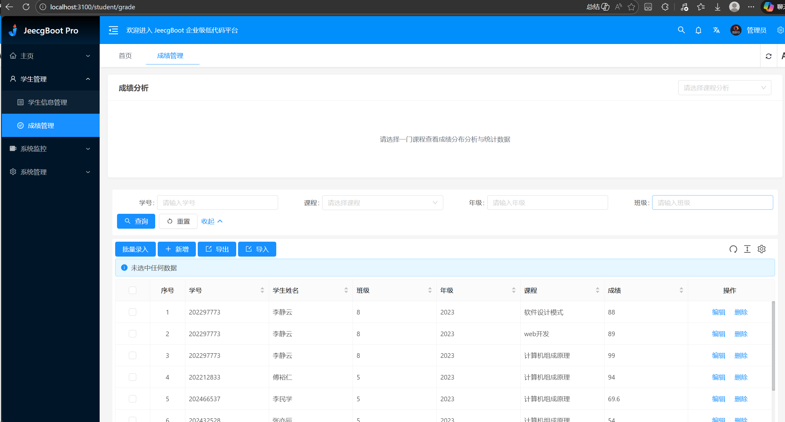
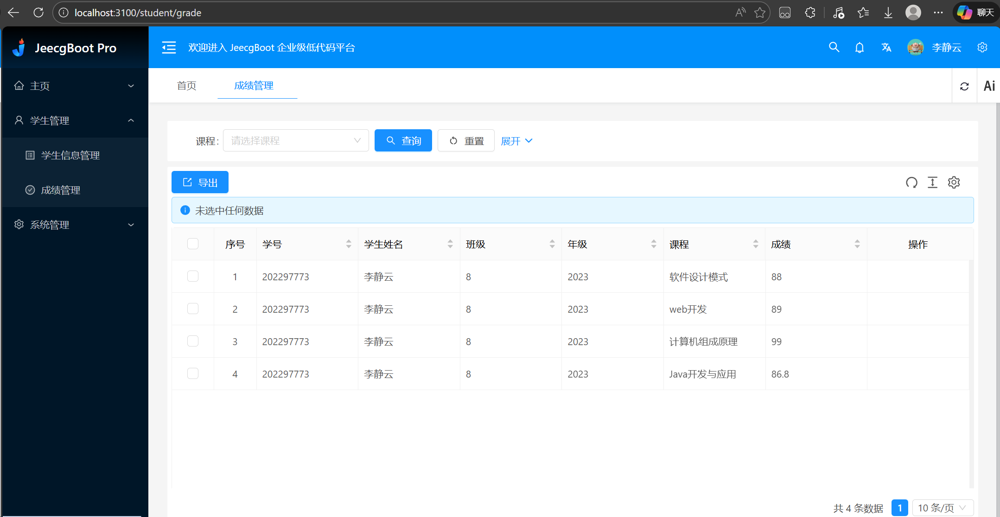
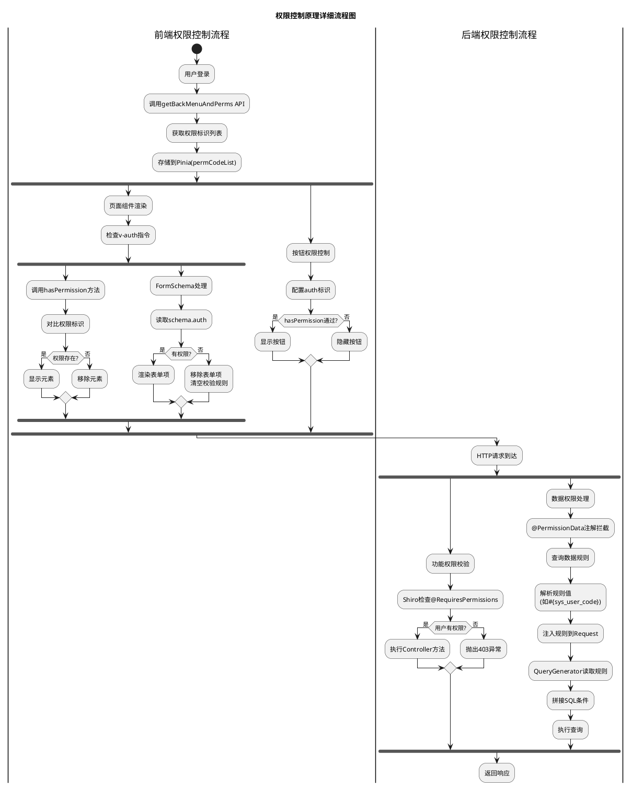

# 权限管理相关笔记

## 第一部分：使用权限系统的操作过程
### 后端配置权限规则，使学生用户只能查看自己的成绩记录，且禁止访问编辑等接口。
#### 一、在“成绩管理”表单中配置数据权限规则
1. 登录JeecgBoot系统，进入“系统管理” → “菜单管理”
2. 找到“成绩管理”菜单，点击更多->“数据规则”
3. 添加数据规则：
    - 规则名：只能查看自己
    - 规则条件：自定义sql
    - 规则值：`g.student_no in  ('#{sys_user_code}')`
    - 说明：g.student_no为联表查询的学号字段，sys_user_code为当前登录用户的用户账号（学生用户账号即为学号），写成g.student_no是为了适应在jeecg-boot\jeecg-boot-module\jeecg-module-student\target\classes\org\jeecg\modules\student\mapper\xml\StudentGradeMapper.xml中联表查询的情况。如果简单使用student_no字段会报错字段冲突。
4. 保存数据规则
#### 二、给学生角色分配“成绩管理”菜单的查看权限规则
1. 进入“系统管理” → “角色管理”
2. 创建“学生”角色，点击“授权”
3. 授权访问“成绩管理”菜单，点击成绩管理旁边的红色图标，勾选“只能查看自己”数据规则
4. 保存角色授权
#### 三、创建学生用户并分配“学生”角色
1. 进入“系统管理” → “用户管理”
2. 创建用户，填写用户信息，用户名即为学生学号
3. 分配“学生”角色，保存用户
#### 四、在需要权限控制的Controller方法上添加数据权限注解
1. 打开`jeecg-boot-module-student/src/main/java/org/jeecg/modules/student/controller/StudentGradeController.java`
2. 在需要权限控制的方法上添加`@PermissionData`和`@RequiresPermissions`注解，例如：
```java
@PermissionData(pageComponent="student/grade/index")   // 对应前端页面组件路径，用于查询规则
@RequiresPermissions("edit")                           // 需要具备的授权，用于方法访问控制
```
#### 五、使用学生用户登录系统测试
1. 使用刚创建的学生用户登录系统，进入“成绩管理”菜单，只能看到自己学号对应的成绩记录，无法查看其他学生的成绩
2. 使用刚创建的学生用户登录系统，进入“成绩管理”菜单，点击编辑或删除按钮，提示无权限操作

### 前端权限控制
#### 一、显示隐藏控制
> 例如：
```javaScript
{
  label: '编辑',
  auth: 'edit',   // 按钮权限标识
  onClick: handleEdit.bind(null, record),
},
```
> 或者使用hasPermission方法控制显示：
```vue
<Button type="primary" v-if="hasPermission('studentGrade:batchAdd')" @click="openBatchModal">批量录入</Button>
```
#### 二、后台进入菜单管理页面配置权限菜单
1. 进入“系统管理” → “菜单管理”
2. 找到“成绩管理”菜单，点击更多->“添加下级”->“按钮/权限”
3. 创建“编辑”按钮，权限标识填写“edit”
4. 保存按钮
#### 三、角色授权按钮权限
1. 进入“系统管理” → “角色管理”
2. 找到“aiadmin”等需要授权的角色，授权新增的“编辑”按钮权限，学生没有授权自然看不到编辑按钮
3. 保存角色授权，此时管理员可以正常看到并使用编辑按钮

#### 四、使用学生用户登录系统测试
1. 使用刚创建的学生用户登录系统，进入“成绩管理”菜单，看不到“编辑”和“导入”等按钮


## 第二部分：前端权限控制原理（工作流程）

1.  配置权限：在代码中为按钮或表单项配置 `auth` 标识。
2.  获取权限：系统登录/初始化时，从后端 API 获取当前用户拥有的所有权限标识集合。
3.  存储权限：将获取到的权限标识集合存储在全局状态管理 (Pinia) 中。
4.  校验权限：在页面渲染时，通过指令或 Hook 函数校验当前组件的 `auth` 标识是否存在于用户权限集合中。
5.  控制显示：如果校验不通过，则从 DOM 中移除元素或不渲染该组件。

### 1. 权限标识配置

在前端页面开发中，可以通过两种方式配置权限：

*   方式 A：在 Form Schema 中配置 (针对表单项)
    在 `FormSchema` 定义中增加 `auth` 字段。
    ```typescript
    // jeecgboot-vue3\src\components\Form\src\types\form.ts
    export interface FormSchema {
      // ...
      // basicForm支持v-auth指令(权限控制显隐)
      auth?: string; 
    }
    ```
    配置示例：
    ```typescript
    {
      label: '编辑',
      auth: 'edit', // 权限标识
      component: 'Input',
    }
    ```

*   方式 B：在模板中使用 v-if 指令 (针对任意元素)
    ```vue
    <a-button v-if="hasPermission('edit')">编辑</a-button>
    ```

*   方式 C：在模板中使用 v-auth 自定义指令 (针对任意元素)
    ```vue
    <a-button v-auth='edit'>编辑</a-button>
    ```
### 2. 权限信息获取

用户登录后或页面刷新时，前端会请求后端接口获取权限列表。
onBeforeUnmount 
--> usePermissionStore 
--> buildRoutesAction 
--> changePermissionCode 
--> changePermissionCode 
--> getBackMenuAndPerms 
--> 返回权限列表
*   调用动作: `changePermissionCode`
    位置: `jeecgboot-vue3\src\store\modules\permission.ts`
    ```typescript
    async changePermissionCode() {
      // 调用 API 获取菜单和权限
      const systemPermission = await getBackMenuAndPerms();
      const codeList = systemPermission.codeList;
      // 将权限码列表存入 Store
      this.setPermCodeList(codeList);
      // ...
    },
    ```

*   API 接口: `getBackMenuAndPerms`
    位置: `jeecgboot-vue3\src\api\sys\menu.ts`
    ```typescript
    enum Api {
      GetMenuList = '/sys/permission/getUserPermissionByToken',
    }
    export function getBackMenuAndPerms() {
      return defHttp.get({ url: Api.GetMenuList }).catch((e) => { /* ... */ });
    }
    ```
*   此接口返回内容类似：
    ```json
    {
    "success": true,
    "message": "",
    "code": 0,
    "result": {
        "allAuth": [
            {
                "action": "btn:add",
                "describe": "btn:add",
                "type": "1",
                "status": "1"
            },
            {
                "action": "system:user:edit",
                "describe": "用户编辑",
                "type": "1",
                "status": "1"
            },
            ...
        ],
        ···
      }
    }
    ```

### 3. 权限信息存储

获取到的权限列表被存储在 Pinia 的 `permission` store 中。

*   Store 定义: `usePermissionStore`
    位置: `jeecgboot-vue3\src\store\modules\permission.ts`
    ```typescript
    export const usePermissionStore = defineStore({
      id: 'app-permission',
      state: (): PermissionState => ({
        // 权限码列表
        permCodeList: [],
        // ...
      }),
      actions: {
        setPermCodeList(codeList: string[]) {
          this.permCodeList = codeList;
        },
        // ...
      }
    });
    ```

### 4. 权限校验逻辑

校验逻辑封装在 `usePermission` Hook 中。
*   Hook: `usePermission` -> `hasPermission`
    位置: `jeecgboot-vue3\src\hooks\web\usePermission.ts`
    ```typescript
    export function usePermission() {
      const permissionStore = usePermissionStore();

      function hasPermission(value?: RoleEnum | RoleEnum[] | string | string[], def = true): boolean {
        // ...
        const allCodeList = permissionStore.getPermCodeList as string[];
        // 检查权限列表中是否包含当前所需的 value
        if (!isArray(value) && allCodeList && allCodeList.length > 0) {
          return allCodeList.includes(value);
        }
        // ...
        return true;
      }
      return { hasPermission };
    }
    ```
- 在hasPermission函数中，读取 Pinia Store 中存储的权限码列表 `permCodeList`，并检查传入的 `value` 是否存在于该列表中。

### 5. Form Schema 实现原理

*   渲染层处理: `BasicForm` 组件
    `BasicForm` 在渲染表单项时，会读取 Schema 中的 `auth` 属性，并将其绑定到 `<FormItem>` 组件的 `v-auth` 指令上。
    位置: `jeecgboot-vue3\src\components\Form\src\BasicForm.vue`
    ```typescript
    <template v-for="schema in getSchema" :key="schema.field">
        <FormItem
          ...
          :schema="schema"
          ...
          v-auth="schema.auth" <!-- 直接绑定指令 -->
        >
        ...
        </FormItem>
    </template>
    ```
    一旦 `v-auth` 指令检测到无权限，会直接从 DOM 中移除该表单项。

*   校验层处理: `FormItem` 组件
    仅仅移除 DOM 是不够的，如果表单项包含 `required` 等校验规则，还需要防止提交时触发校验错误。
    位置: `jeecgboot-vue3\src\components\Form\src\components\FormItem.vue`
    ```typescript
    function handleRules(): ValidationRule[] {
        const { rules: defRules = [], ..., auth, field } = props.schema;
        // ...
        // 代码逻辑说明: 【TV360X-842】必填项v-auth、show隐藏的情况下表单无法提交
        const { hasPermission } = usePermission();
        // 如果无权限，则清空校验规则，避免提交时报错
        if ((auth && !hasPermission(auth))) {
          return [];
        }
        // ...
    }
    ```

### 6. v-auth 自定义指令实现
*   指令定义: `v-auth`
    位置: `jeecgboot-vue3\src\directives\permission.ts`
    ```typescript
    const authDirective: Directive = {
      mounted: (el: Element, binding: DirectiveBinding<any>) => {
        isAuth(el, binding);
      },
    };
    ```
    - 应用启动时，通过 setupPermissionDirective 函数将其注册为全局指令 v-auth。
    - 指令生命周期钩子 mounted 会在绑定元素被插入父节点时触发，调用 isAuth 函数。
    ```typescript
    // src/directives/permission.ts (简化版)
    function isAuth(el: Element, binding: any) {
      const value = binding.value;
      if (!value) return;
      
      const { hasPermission } = usePermission();
      // 关键点：如果没有权限，直接移除 DOM 节点
      if (!hasPermission(value)) {
        el.parentNode?.removeChild(el);
      }
    }
    ```
    - 获取对应值：读取 v-auth="value" 中传入的权限标识（binding.value），例如 'student:edit'。
    - 调用校验钩子：使用 usePermission Hook 中的 hasPermission 方法进行校验(4中的)。
    - 移除元素：如果校验结果为 false（无权限），则通过原生的 DOM API el.parentNode?.removeChild(el) 将该元素彻底删除。

## 第三部分：后端权限控制原理

后端权限控制主要分为 **功能权限** 和 **数据权限** 两个部分。

### 1. 功能权限控制

功能权限控制主要依赖 Apache Shiro 框架，通过 AOP 切面拦截带有 `@RequiresPermissions` 注解的方法。

*   **注解定义**:
    该注解属于 Shiro 框架 `org.apache.shiro.authz.annotation.RequiresPermissions`。
    
*   **拦截逻辑**:
    当请求到达 Controller 时，Shiro 的 AOP 切面会拦截请求，获取当前登录用户的 `Subject`，并调用例如 `checkPermission("student:edit")` 方法。如果用户没有该权限，抛出 `AuthorizationException`，通常由全局异常处理器捕获并返回 403 或错误提示。

### 2. 数据权限控制

数据权限的过程是：**拦截请求 -> 获取规则 -> 注入 SQL**。

#### 主要流程
1.  **Aspect 拦截**: `PermissionDataAspect` 拦截带有 `@PermissionData` 注解的方法。
2.  **获取规则**: `SysBaseApiImpl` 中查询数据库中配置的数据规则（如 `g.student_no = '#{sys_user_code}'`）。
3.  **缓存**: 将规则暂时存储在 `HttpServletRequest` 中（通过 `JeecgDataAutorUtils` 工具类）。
4.  **SQL 注入**: 在 Service 层构建查询时，`QueryGenerator` 读取 Request 中的规则，自动拼接 SQL 到 `QueryWrapper` 中。

#### 代码解析

##### **一：注解切面拦截**
位置: `jeecg-boot-base-core/src/main/java/org/jeecg/common/aspect/PermissionDataAspect.java`
```java
@Aspect
@Component
public class PermissionDataAspect {
    
    @Pointcut("@annotation(org.jeecg.common.aspect.annotation.PermissionData)") // 切点：标注了 @PermissionData 注解的方法
    public void pointCut() {}                                                   // 切点方法

    @Around("pointCut()")
    public Object arround(ProceedingJoinPoint point) throws Throwable {
        // 1. 获取注解上的 pageComponent (例如 "student/grade/index")
        MethodSignature signature = (MethodSignature) point.getSignature();
        PermissionData pd = signature.getMethod().getAnnotation(PermissionData.class);
        String component = pd.pageComponent();

        // 2. 根据 component 和当前用户，查询数据库配置的权限规则
        List<SysPermissionDataRuleModel> dataRules = commonApi.queryPermissionDataRule(component, requestPath, username);
        
        // 3. 将规则注入到当前 Request 上下文中
        if(dataRules != null && dataRules.size() > 0) {
            JeecgDataAutorUtils.installDataSearchConditon(request, dataRules);
        }
        
        return point.proceed();
    }
}
```

##### **二：查询生成器注入 SQL**
位置: `jeecg-boot-base-core/src/main/java/org/jeecg/common/system/query/QueryGenerator.java`
```java
public class QueryGenerator {
    
    // 在 Controller/Service 调用 initQueryWrapper 时触发
    public static <T> QueryWrapper<T> initQueryWrapper(...) {
        QueryWrapper<T> queryWrapper = new QueryWrapper<T>();
        installMplus(queryWrapper, ...);
        return queryWrapper;
    }

    // 将数据权限规则注入 QueryWrapper
    private static void installMplus(QueryWrapper<?> queryWrapper, ...) {
        // ...
        // 1. 从 Request 中获取之前 Aspect 存入的规则
        Map<String, SysPermissionDataRuleModel> ruleMap = getRuleMap();

        // 2. 遍历规则，动态拼接到 QueryWrapper 中
        for (String c : ruleMap.keySet()) {
            SysPermissionDataRuleModel dataRule = ruleMap.get(c);
            // 解析规则值 (例如将 #{sys_user_code} 替换为实际登录账号)
            String ruleValue = getSqlRuleValue(dataRule.getRuleValue());
            // 拼接 SQL (例如 queryWrapper.and(i -> i.apply("g.student_no = 'admin'")))
            addRuleToQueryWrapper(dataRule, column, ..., queryWrapper);
        }
    }
}
```

##### **三：当前情景的特殊处理**
- 位置: `jeecg-boot-module-student/src/main/java/org/jeecg/modules/student/service/impl/StudentGradeServiceImpl.java`
```java
@Override
public IPage<StudentGrade> queryPageList(StudentGrade studentGrade, Integer pageNo, Integer pageSize, java.util.Map<String, String[]> parameterMap) {
    // 解决多表关联查询 student_no 字段冲突
    String studentNo = studentGrade.getStudentNo();
    studentGrade.setStudentNo(null);
    QueryWrapper<StudentGrade> queryWrapper = QueryGenerator.initQueryWrapper(studentGrade, parameterMap);
    // 恢复并手动添加带别名的查询条件
    if(studentNo != null && !studentNo.isEmpty()){
        studentGrade.setStudentNo(studentNo);
        queryWrapper.like("g.student_no", studentNo.replace("*", ""));
    }
    // ···
    Page<StudentGrade> page = new Page<StudentGrade>(pageNo, pageSize);
    return this.baseMapper.queryStudentGradePage(page, queryWrapper);
}
```
- 由于 `student_no` 字段在多表联查时存在冲突，故在查询前将其置空，待 `QueryGenerator` 拼接完规则后，再手动添加带别名的查询条件 `g.student_no`。

## 流程图

> 流程图源码：
